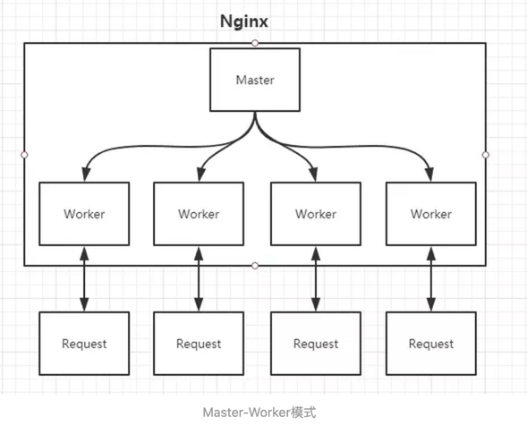
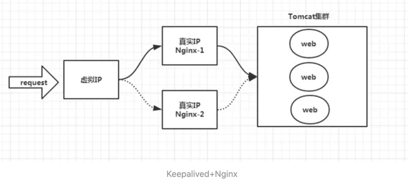

## VPN
VPN 虚拟专用网络， 属于远程访问技术，简单说就是利用公用网络架设专用网络  
### 作用:  
**由公网访问内网**  
在内网中架设一台VPN服务器， 通过互联网连接VPN服务器，然后通过VPN服务器进入企业内网  
**数据加密**  
VPN服务器和客户机之间的通讯数据进行了加密处理  
有了数据加密就可以认为数据是在一条专用的数据链路上进行安全传输，就如同专门架设了一个专用网络，但实际上VPN使用的是
互联网上的公用链路，因此VPN成为虚拟专用网络  
**隐藏IP地址**  
隐藏真实IP地址
## 代理服务器
### 正向代理
正向代理，代理的是客户端，而客户端是知道目标的，而目标是不知道客户端是通过VPN访问的  
**场景**  
由于防火墙原因，我们不能直接谷歌，我们可以借助VPN来实现，这就是正向代理的例子
  
**举例**

### 反向代理
反向代理，代理的是服务端  
当我们访问服务端时，会先访问代理服务器，然后进行转发，代理到内网去，而客户端不知道具体访问哪个服务器
  
**举例**  
Nginx

## Nginx
Nginx是反向代理服务器

### Master-Worker模式
nginx监听80端口，nginx会启动 master 和 worker 进程  
  

#### Master进程作用
**读取并验证配置文件nginx.conf**
**管理worker进程**  
接收来自外界的信号，向各 worker 进程发送信号  
监控 worker 进程的运行状态，当 worker 进程退出后(异常情况下)，会自动重新启动新的 worker 进程  
#### Worker进程作用
基本的网络事件（连接和请求），则是放在 worker 进程中来处理  
多个 worker 进程之间是对等的，他们同等竞争来自客户端的请求，各进程互相之间是独立的  
一个请求，只可能在一个 worker 进程中处理，一个 worker 进程，不可能处理其它进程的请求（不用加锁）    
worker 进程的个数由配置文件决定，一般我们会设置与机器cpu核数一致  

### Nginx如何做到处理高并发场景
**Nginx 采用多 worker 的方式来处理请求，每个 worker 里面只有一个主线程，那能够处理的并发数很有限啊，多少个 worker 就能处理多少个并发，何来高并发呢？**  
Nginx 采用了异步非阻塞的方式来处理请求，linux的epoll模型  
它们提供了一种机制，让你可以同时监控多个事件，调用他们是阻塞的，但可以设置超时时间，在超时时间之内，如果有事件准备好了，就返回。这种机制正好解决了我们上面的两个问题

### Nginx 动静分离处理
目的: 提供处理速度  
静：把静态资源放到Nginx，由nginx管理，当请求这些资源时，nginx直接处理，不用发往后端
动：动态请求发送到后端
nginx.conf root中配置的时静态资源，可以由Nginx直接返回  
nginx.conf proxy_pass说明是动态请求，需要进行转发
### Ip控制
Nginx层配置，添加黑名单，进行拦截
### 反向代理 proxy_pass
proxy_pass配置  
request -> Nginx -> server  
注意，此时server端看到的请求地址是nginx地址，nginx可以自定义设置 http header
### 负载均衡 upstream
反向代理中，proxy_pass来指定server地址，但只能指定一台，如何实现负载均衡  
**方式**
- 通过upstream定义一组server,并指定策略
- 将proxy_pass替换为upstream指定的值

### Nginx如何保证高可用
Nginx作为入口网关，单点出问题，不可接受  
方式： Keepalived+Nginx  
实现方式：  
1. 请求不要直接打到Nginx上，应该先通过Keepalived（这就是所谓虚拟IP，VIP）
2. Keepalived应该能监控Nginx的生命状态（提供一个用户自定义的脚本，定期检查Nginx进程状态，进行权重变化,，从而实现Nginx故障切换）  

### Nginx 如何实现热部署
修改完nginx.conf配置文件之后，master读取配置，重新生成新的worker进程

